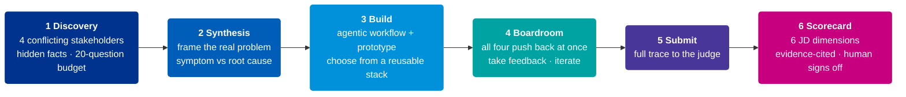
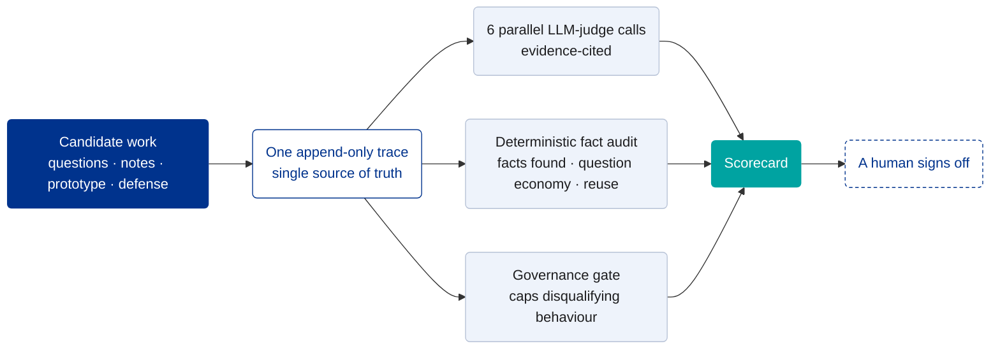

<div align="center">

# Day One

### An evaluation environment for AI&nbsp;Builders, the KPMG case study, built end to end.

**It evaluates candidates by what they *do* in a real, ambiguous engagement, not by what a résumé claims.**

[](https://proving-ground-gamma.vercel.app)
&nbsp;
[](https://proving-ground-gamma.vercel.app/report/sample-strong)
&nbsp;
[](https://proving-ground-gamma.vercel.app/report/sample-weak)

`Next.js 16` · `TypeScript` · `Claude Opus 4.8 + Sonnet 4.6` · `evidence-cited LLM judge + deterministic audit + human sign-off`

</div>

---

> **The brief asked for a way to evaluate AI&nbsp;Builder candidates.** A résumé screener cannot see the role's defining behaviours. So I built the work sample itself.
>
> **Thesis: with AI, answers are cheap; the expensive skill is asking the right question of the right person, and knowing when to stop.** That is the headline of the rubric.

A candidate is dropped into one ambiguous engagement at **Maple & Birch LLP** (a fictional Big-Four-style audit firm missing its deadlines), interviews four LLM stakeholders who hold conflicting and partial information, frames the real problem, designs and prototypes a solution, defends it to all four at once, and revises. Every action is recorded to a single trace, then scored against the job description, with the evidence cited and a human signing off.

---

## The candidate's journey

One continuous, fully recorded engagement:



The hidden facts are the mechanism: the real root cause is an ERP data-format change the Senior never escalated; IT already runs a production API that solves it; a regulator review is six weeks out. They surface **only under a genuinely good question**, so question quality becomes measurable, not a vibe.

---

## Every requirement of the job description, solved

| What the role demands | ✓ | How Day&nbsp;One tests and rewards it |
|---|---|---|
| Enterprise fluency: find real pain points under ambiguity | ✅ | Four conflicting stakeholders, hidden facts, no defined answer; scored on facts surfaced `D1` |
| Turn ambiguity into a sharp problem; end-to-end ownership | ✅ | Synthesis graded on root-cause framing and explicit non-goals `D2` |
| Think in workflows, not models: human-AI handoffs, autonomy boundaries | ✅ | Build spec judged as an agentic workflow with sign-off gates `D3` |
| Builder mindset: make something real; reuse components | ✅ | Real prototype; candidate is **given a reusable-component stack and chooses what fits**, so each build starts further ahead `D4` |
| Build, test, learn, iterate | ✅ | Boardroom pushback forces revision; iteration is scored, not just the first answer `D4` |
| Use AI to augment, not outsource, understanding | ✅ | The copilot is logged; scored on whether AI sharpened or replaced their judgment `D5` |
| Risk, governance, ethics, trust as core design constraints | ✅ | Governance is a scored constraint **and** a hard gate: audit trail, sign-off, regulator awareness `D6` |
| Integrations with enterprise platforms and data sources | ✅ | A hidden fact is an existing production API; the best candidates integrate it rather than rebuild |

Two weight profiles (Senior Consultant vs Manager) sit over the same six dimensions. A **governance gate** caps the total on disqualifying behaviour.

---

## How every score is produced



- A **hidden-marker protocol** turns *"did they reach the truth"* into a hard measurement that anchors the AI judge, so scores are evidence, not vibes.
- **Every score cites trace evidence**, name-blind, linking to the exact moment it happened.
- **The LLM proposes; a human decides.** Decision support, never an auto-reject, mirroring KPMG's position that no hiring decision is made by AI.

---

## Proof it discriminates

Both runs were generated through the **real** pipeline, not mocked:

| Same pipeline, two runs | Strong | Weak |
|---|:--:|:--:|
| **Weighted score** | **4.00** | **1.00** |
| Critical facts uncovered (of 4) | 4 | 0 |
| Questions | 10, well distributed | 4, all to one persona |
| Governance gate | clear | **triggered** |

→ [See the strong scorecard](https://proving-ground-gamma.vercel.app/report/sample-strong) · [See the weak scorecard](https://proving-ground-gamma.vercel.app/report/sample-weak)

---

## Scoped under a three-hour cap

Built the full loop end to end for **one scenario** with **two seeded sample runs**. Deliberately left out leadership assessment and production-grade coding: a solo sandbox cannot test those honestly, so they route to other funnel stages, and I say so. Models are tiered for the job, **fast Sonnet 4.6 for the personas, Opus 4.8 where scoring quality matters**. The framing, the rubric, and the hidden-fact mechanism were my calls, and I can defend every one. Next step: calibrate against KPMG's current AI&nbsp;Builders.

---

## Run it locally

```bash
cd proving-ground
echo "ANTHROPIC_API_KEY=sk-ant-..." > .env.local
npm install
npm run dev      # http://localhost:3000
npm test         # unit tests: store, markers, judge assembly
```

---

## Read more

- **[Full architecture, rubric, and design notes](proving-ground/README.md)** , the deep technical write-up.
- **[Persona ground truth](docs/persona-dossiers.md)** , every persona fact cited to primary sources.
- **[Design spec](docs/superpowers/specs/2026-06-10-day-one-design.md)** and **[implementation plan](docs/superpowers/plans/2026-06-10-day-one.md)**.

#### How AI was used (disclosure)

The framing, rubric design, hidden-fact mechanism, model tiering, and scope cuts were **my** decisions. AI accelerated research (audit-firm dynamics cited to primary sources), generated code against my spec, and is the runtime engine. I can defend every architectural and evaluation choice.

<div align="center"><br/><sub>Integrity · Excellence · Courage · Together · For Better</sub></div>
